# Plataforma de Control de Misiones Espaciales

Este proyecto es una plataforma de control y gestión de misiones espaciales desarrollada como proyecto personal para practicar desarrollo de software, Cloud/DevOps, integración continua y automatización del despliegue. En otras palabras, se trata de un sistema mediante una API, una base de datos y herramientas de automatización, calidad y seguridad del software.

## Tecnologías y uso en el proyecto

### API y base de datos

- Python: lenguaje principal para desarrollar la aplicación.
- FastAPI: utilizado para crear la API REST.
- PostgreSQL: utilizado para la base de datos relacional y así almacenar la información de la aplicación.
- SQLAlchemy: para la conexión entre Python y PostgreSQL.
- Psycopg2: para la comunicación entre SQLAlchemy y PostgreSQL.

### Contenedores

- Docker: para construir la imagen de la API y ejecutarla en un contenedor aislado.
- Docker Compose: para ejecutar conjuntamente los servicios de la API y PostgreSQL.

### Control de versiones e integración continua

- Git: para registrar los cambios del proyecto.
- GitHub: para guardar el repositorio del proyecto.
- GitLab: para guardar el repositorio y ejecutar automáticamente el pipeline de integración continua cuando se suben cambios.
- GitLab CI/CD: utilizado para definir y automatizar las etapas de validación del proyecto (la ejecución de pruebas y el análisis de SonarQube).
- Pytest: para ejecutar pruebas y comprobar que la lógica de la aplicación funciona.

### Calidad y seguridad del código

- SonarQube: para analizar el código y poder detectar problemas, como por ejemplo, problemas de seguidad.

### Automatización del despliegue

- Jenkins: para ejecutar un pipeline que prepara el entorno, ejecuta las pruebas automatizadas y el proceso de despliegue.
- Ansible: para automatizar las tareas de despliegue en un playbook ejecutando Docker Compose para construir y levantar los servicios.

## Objetivos del proyecto

- Desarrollar y organizar una API REST con FastAPI.
- Configurar la conexión entre la aplicación y PostgreSQL.
- Contenerizar los servicios mediante Docker y Docker Compose.
- Automatizar las pruebas y validaciones mediante pipelines.
- Analizar la calidad y seguridad del código con SonarQube.
- Automatizar tareas de despliegue mediante Jenkins y Ansible.
- Gestionar el código fuente y mantener sincronizados los repositorios de GitLab y GitHub.

## Capturas de pantalla

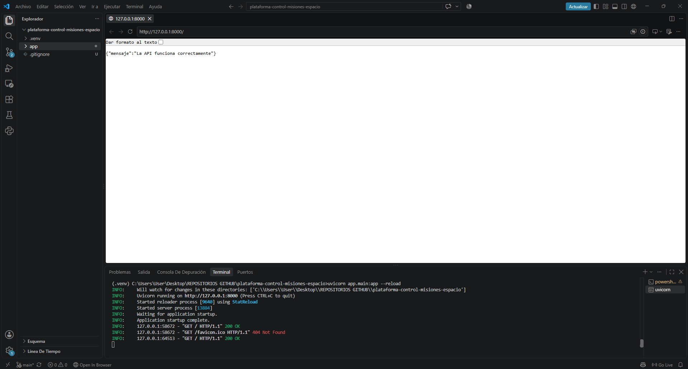
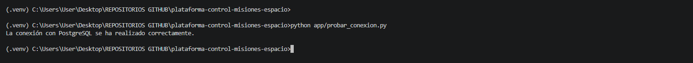
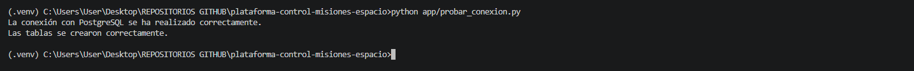
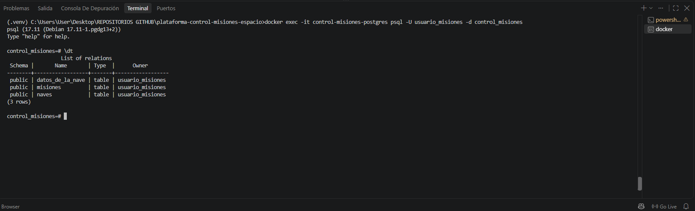
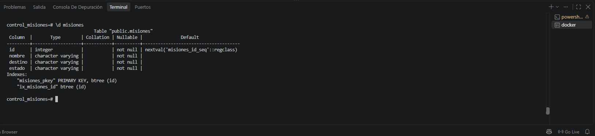
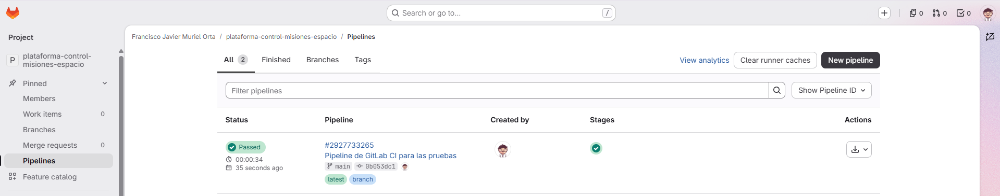
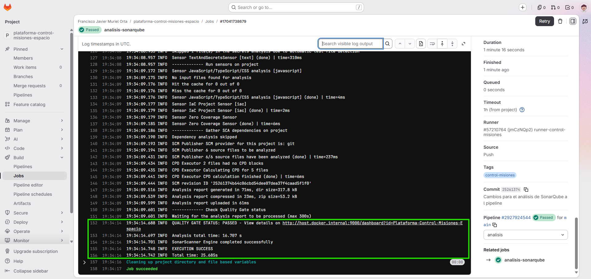
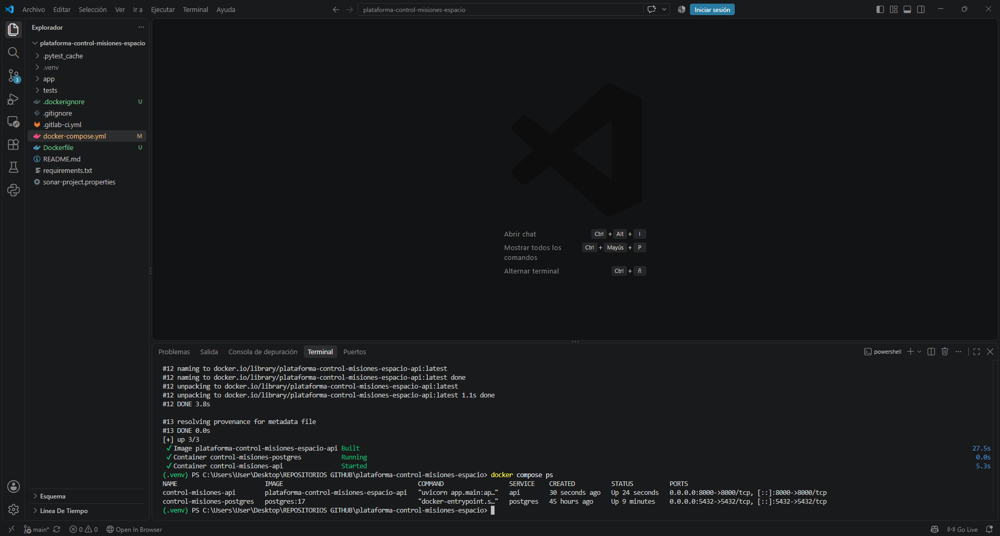
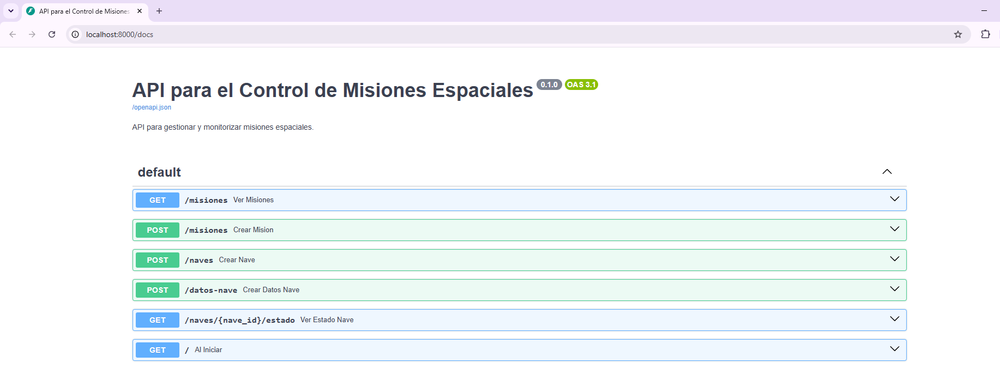
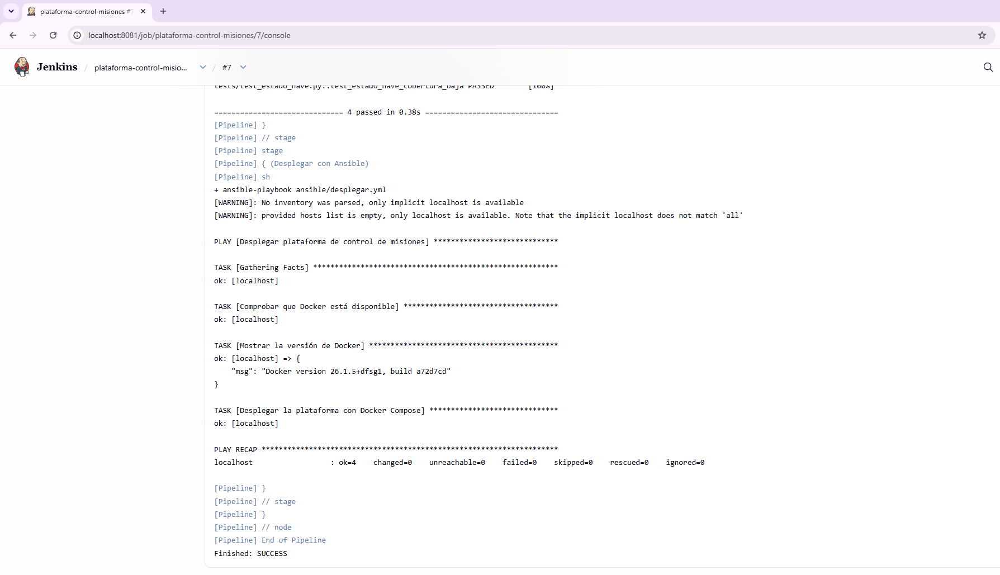

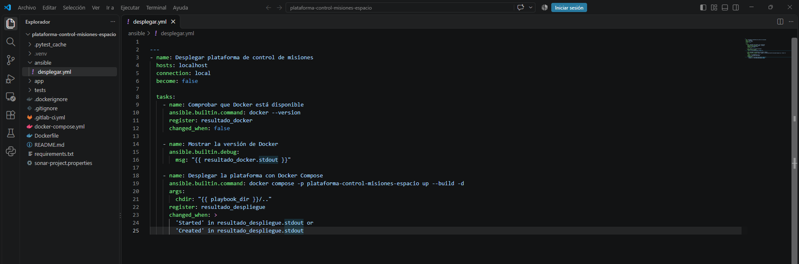

## ¿Cómo ejecutarlo en local?

### Requisitos previos

- Python.
- Docker y Docker Compose.
- Git.

### Pasos de instalación

1. Clonar el repositorio:

   ```bash
   git clone https://gitlab.com/fjavierhuelvacontact/plataforma-control-misiones-espacio.git
   cd plataforma-control-misiones-espacio
   ```

2. Crear un archivo `.env` en la raíz del proyecto a partir de `.env.example`.

3. Configurar las variables de entorno necesarias en `.env`, incluida la contraseña de PostgreSQL.

4. Construir los servicios:

   ```bash
   docker compose up --build -d
   ```

5. Acceder a la documentación de la API:

   `http://localhost:8000/docs`

### Detener los servicios

Para detener los contenedores sin eliminar el volumen de datos:

```bash
docker compose down
```

Los datos almacenados en el volumen de PostgreSQL se mantienen al detener los servicios. No elimines el volumen si quieres conservarlos.

## Mejoras futuras

- Incorporar un asistente de inteligencia artificial para consultar información de las misiones.
- Integración de Gemini y LangChain.